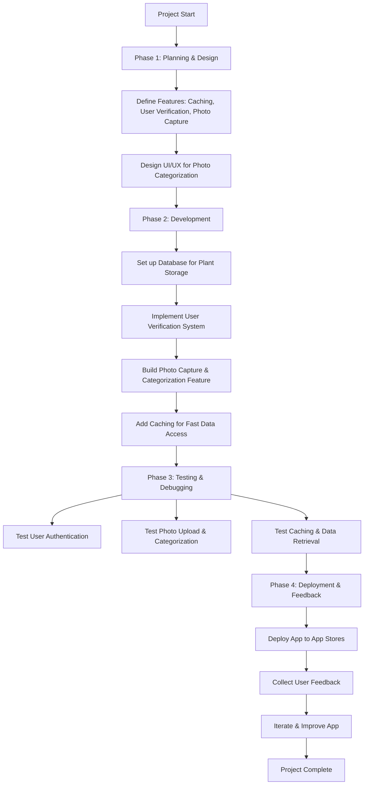

# 🖥️Sustainable Software Engineering App Development Roadmap🖥️

Student project by Will Mitchell, Oskari Alaranta, and Kian Moloney. This project was done over the Spring Semester **Feb-May (2025)** for the class #COMP.SE.221-2024-2025-1 from *Tampere University*. All ideas and logs for the project will be found on this *ReadMe* with the inclusion of dates, and no edits to past ideas/structure/development, this is a prototype app.

# 🚀Idea Development🚀

 **2/5/2025** -- Our current idea was created by will to create a *pokemon-go like* app in which people take pictures of plants, and the app will be able to process there location and reward points/climbing/incentive system inside the app for taking pictures of more plants, and diverse species. There could be inclusion of AI recognizing plant technology if API and time permit. Heavy emphasis on the backend develop, implementations of a database system, caching, user authentication, and location API usage most likely through google. 

**2/12/2025** -- MongoDB is current choice of database system. We have made a simplistic model of the user perspective diagram (more emphasis on image processing) we tried some names like FloraFinder but it already exists :( doesn't do the same thing as our design however. Mapped out the layout of our image processor as its the core of the app, and looked at structures, researched API's and were able to decide on some implementations for back in handling, especially for storing images and location. We went with LeafHunter as the current name of the app!

**2/17/2025** -- Dear Pl@ntNet Team,

We are a student group from Tampere University developing LeafHunter, a prototype app for our course #COMP.SE.221-2024-2025-1. Our app is a Pokémon GO-inspired game where users take pictures of plants to earn rewards based on species diversity and location. Beyond gamification, our vision is to turn users into volunteer scientists, contributing to ecological research by collecting valuable plant data.

A key feature of LeafHunter is the creation of our own open API, which will allow researchers to request anonymized plant location data to better understand urban plant populations and biodiversity patterns. We are committed to transparent data use policies, ensuring ethical handling of user contributions while actively supporting citizen science.

Pl@ntNet’s API would be crucial for our prototype, enabling accurate plant identification while fostering public engagement with biodiversity. As a non-profit student project running from February to May 2025, we are purely focused on technical and educational exploration, with no revenue generation.

We would love the opportunity to integrate Pl@ntNet’s API under a non-profit profile and collaborate in promoting scientific discovery. Please let us know the requirements or conditions for access—we’re happy to provide additional details and acknowledgments.

Thank you for your time and consideration. We appreciate your support in empowering students and citizen scientists alike!

Best regards,
Will Mitchell, Oskari Alaranta, and Kian Moloney
Tampere University – LeafHunter Project

(Letter requested of the Pl@netNet team to get there Non-Profit subscription possibly for free!)

**2/17/2025** -- Development Timeline and Steps
**Internal Deadline April 30th!**
We looked at a roughly sketched out the layout of our design, planned out buttons and discussed API data security and soforth!
We looked into ngrok for network handling
Plan for next week - 
Will - UI static page with working buttons and logo
Kian - Oauth and login page
Oskari - Code Structure and management
10 weeks left
4 - UI
4 - Backend
2 - Testing/polishing!

## Structure

## Schema
### User Schema
[](https://mermaid.live/edit#pako:eNplUk1P3DAQ_StTnxYB6n0PVTeElkikSgm9dLMH40wSq45na4-FEOa_48R8SfjkmXnv6c2zH4WiHsVWwGDoXk3SMdyWnYV0dvs_Ht0Bzs-_xZZmhF3g6UuEYnONcoCrYBndSWczulhxzURMcCvvIlT7XDSOFHqv7XjIyGpBQqzqn0UBAzmYyHMawylck5KsycIN_g_oOUK5aSd9BKPtvzQ3r_Ok20uWd9Ij1GRHKouTrF5m9QtpjIddU8G95mnlR6g3S2MZQWO-W_6FvEBemHVm3iAHZz2oBaYt-KAW_0Mwsfy46gUZg2p1s-57uX_vvGx6mRXLV6e_A7qH2Ky5JgfSMnziZPEWeYnk61XKPcKPzGiZHPZQ2RTavOZwEGdixlToPr3h46LQCZ5wxk5s09ViYCdNJzr7lKAyMLUPVoktu4BnwlEYJ7EdpPGpCscUKZZajk7Ob92jtH-J3mvsdbJR51-jyA56FE_PhOjAtg)

## To-Do
**2/12/2025** -- Email Pl@ntNet about student non-profit API thing to use??
