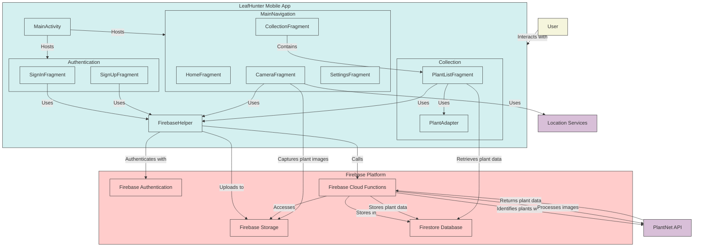
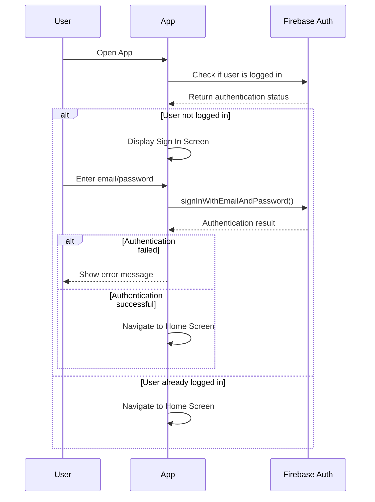
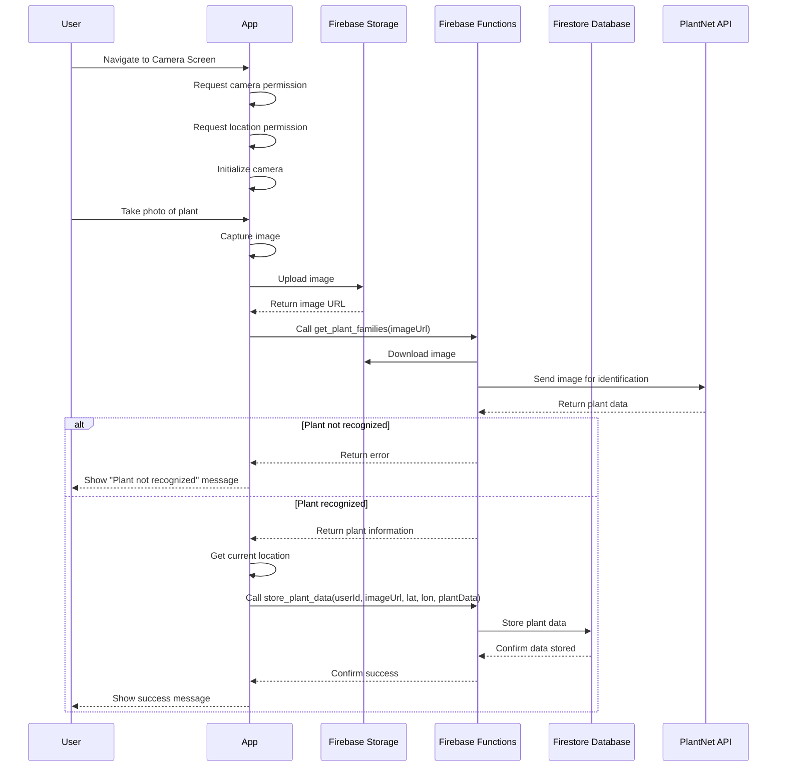
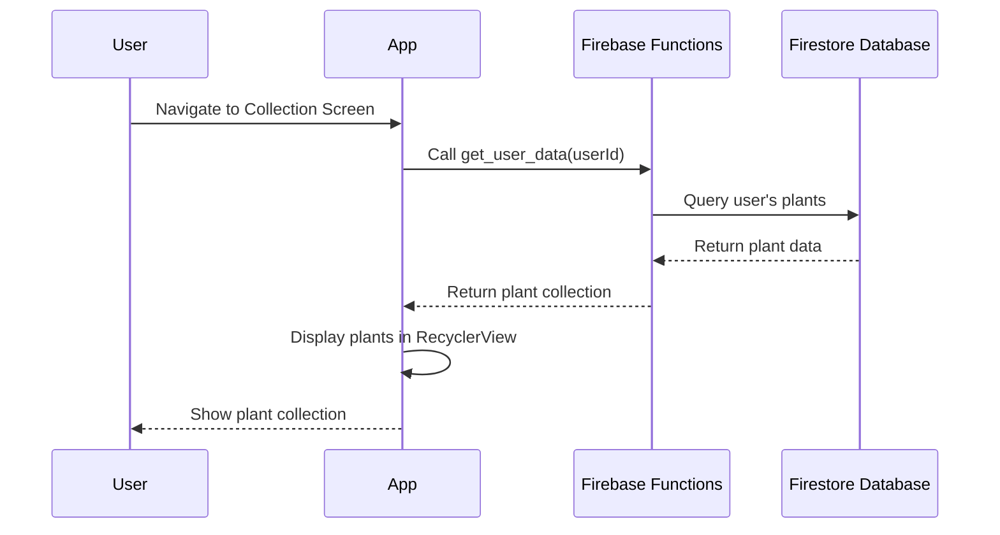

# LeafHunter App

Student project by Will Mitchell, Oskari Alaranta, and Kian Moloney. This project was done over the Spring Semester **Feb-May (2025)** for the class #COMP.SE.221-2024-2025-1 from *Tampere University*. All ideas and logs for the project will be found on this *ReadMe* with the inclusion of dates, and no edits to past ideas/structure/development, this is a prototype app.

## 🚀Idea Development🚀

 **2/5/2025** -- Our current idea was created by will to create a *pokemon-go like* app in which people take pictures of plants, and the app will be able to process there location and reward points/climbing/incentive system inside the app for taking pictures of more plants, and diverse species. There could be inclusion of AI recognizing plant technology if API and time permit. Heavy emphasis on the backend develop, implementations of a database system, caching, user authentication, and location API usage most likely through google. 

**2/12/2025** -- MongoDB is current choice of database system. We have made a simplistic model of the user perspective diagram (more emphasis on image processing) we tried some names like FloraFinder but it already exists :( doesn't do the same thing as our design however. Mapped out the layout of our image processor as its the core of the app, and looked at structures, researched API's and were able to decide on some implementations for back in handling, especially for storing images and location. We went with LeafHunter as the current name of the app!

**2/17/2025** -- Email Pl@ntNet -- Got a response, no need for any extra tiers

**2/17/2025** -- Development Timeline and Steps
**Internal Deadline April 30th!**
We looked at a roughly sketched out the layout of our design, planned out buttons and discussed API data security and soforth!    

We looked into ngrok for network handling

Plan for next week - 

Will - UI static page with working buttons and logo

Kian - Oauth and login page

Oskari - Code Structure and management

10 weeks left
4 weeks - UI
4 weeks - Backend
2 weeks - Testing/polishing!

**3/3/2025** -- Repo remade and template files are constructed
Will was finally able to get some work done, and played around with the UI elements and button construction

**3/5/2025** -- UI figuring out, standard code style established being camelCase, and deligated UI work, Kian is working on the login page and a super simple database backend, Will is going to work on basic button design, and espeically the camera button to take photos, and possibly a page for the user profile unconnected to the database for the moment. Looked at the backend implementation and espeically how we are doing image processing, we are going to use the links from mongodb with are aggregate APIs to work with our images. We looking into possibly doing maps as a tool, and Oskari is going to work on our mongodb async database and start on our user collection. We are going to have each user have a personal page in the colleciton, holdling all there information centrally to make all the data handling super fast!

**3/20/2025** -- Kian has created and implemented the sign in page as well as the authentication using gradle for the build stuff, which has turned out to be a gigantic nightmare without even doing google authentication just firebase setup! Will and Oskari are working on UI and backend respectively with a slow start to creating more content for the app, hoping a coding session today will keep us on track! looking to complete the basic design and layout of the app today!

**3/25/2025** -- We decided to switch to a Firebase backend as it was the easiest to manage and control on a small scale and very easy for our pivot from the idea of MongoDB

**4/5/2025** --  Spent a long time looking into transitioning the whole project from our legacy XML layout in android studio to jetpack compose, but ultimately unsuccessful

**4/15/2025** -- Got the basica UI working and some of the backend including lots of the user login and password information, and authentication setup with Firebase

**4/28/2025** -- Got permissions, camera setup and lots of the UI including a cache clearing button up and working, collection was still coming along, but backend was starting to come together, we had the idea to make lamda functions that would make all the processing easier on the client side and safe for users, shifting our architecture to be more self-micro service oriented!

**5/1/2025** -- Backeend was almost completely done, with all the functions and API calls working, but not connected to the app, lots of redesigns of the layout of the application as well as some new stats features and work on the camera

**5/1/2025** -- We were having a hard time looking at how to process the images effiecently, we didn't want to individually host all our own images, so we used a simple trick to turn the pictures into byte arrays upon a successful process, then store just a simple hosted link in our database, so we can separately query the image for collection use, and also not have the overhead of store lots of raw images

**5/29/2025** -- Everything mostly done, collection was completed and UI tweaked to mostly work, camera still need some small changes, but for the most part the app is functional!

## 🌿 LeafHunter App Introduction

### 📌 Purpose

**LeafHunter** is an Android-based Pokémon GO-inspired app where users take pictures of plants to earn rewards. The app aims to turn users into **volunteer scientists**, contributing to ecological research by collecting valuable plant data.

### ✨ Features

- 📷 Take pictures of plants and earn rewards
- 🌱 AI-based plant identification (via Pl@ntNet API)
- 🔐 User authentication (Firebase) and location tracking
- 🗺️ Gamified experience to promote biodiversity awareness

Future development idea: 🌍 Open API for researchers to access anonymized plant location data 

### ⚙️ Technologies

- 📱 **OS**: Android
- 🔥 **Firebase products**
    - 🔐 Authentication
    - 🖼️ Storage (Images)
    - 🗃️ Firestore Database
    - ⚡ Functions
- 🌿 **API**: Pl@ntNet API
- 🧑‍💻 **IDE**: Android Studio
- 💻 **Programming languages used**
    - 🧬 Kotlin
    - 🐍 Python

### 👥 Team Members

- **Will Mitchell** – UI & Design & Infrastructure
- **Kian Moloney** – All things related to Firebase & Location & Authentication
- **Oskari Alaranta** – Camera functionality

### 💎 Chosen features from the given options in the assignment

- Basic features:
    - Database integration
    - Permission requests
    - Images
    - Localization
- Advanced features:
    - Camera functionality
    - Authentication
    - Cloud-based database (Firebase)
    - External APIs (Pl@ntNet API)

**Tampere University – Spring 2025**  
Course: `#COMP.SE.221-2024-2025-1`

## LeafHunter App - Architecture Documentation

### Overview
LeafHunter is a mobile application that allows users to take pictures of plants, identify them using the Pl@ntNet API, and build a personal collection of identified plants with their locations. The app uses Firebase for authentication, storage, serverless functions, and database operations.

### System Architecture

#### Components
1. **Mobile App (Android)**
   - User Interface (Activities and Fragments)
   - Authentication (Sign In/Sign Up)
   - Camera Integration
   - Location Services
   - Plant Collection Management

2. **Firebase Platform**
   - Authentication - Handles user registration and login
   - Storage - Stores plant images
   - Cloud Functions - Serverless backend for API calls and data processing
   - Firestore - NoSQL database for storing plant data

3. **External Services**
   - Pl@ntNet API - Plant identification service
   - Device Location Services - Provides geolocation data

#### Architecture Diagram

### Sequence Diagrams

#### Authentication Flow

#### Plant Identification Flow

#### Collection View Flow

### Key Components

#### Mobile App
1. **MainActivity**: The main entry point of the app that hosts the navigation components.
2. **Authentication**:
   - **SignInFragment**: Handles user login with email and password
   - **SignUpFragment**: Handles user registration with email and password
3. **Main Navigation**:
   - **HomeFragment**: The home screen of the app
   - **CameraFragment**: Handles camera integration and plant image capture
   - **CollectionFragment**: Displays the user's plant collection
   - **SettingsFragment**: Handles app settings
4. **Collection**:
   - **PlantListFragment**: Displays a list of the user's collected plants
   - **PlantAdapter**: Adapts plant data for display in a RecyclerView
5. **FirebaseHelper**: Utility class that handles interactions with Firebase services

#### Firebase Platform
1. **Authentication**: Handles user registration, login, and session management
2. **Storage**: Stores plant images uploaded by users
3. **Cloud Functions**:
   - **get_plant_families**: Downloads image from Storage, sends to Pl@ntNet API, returns plant information
   - **store_plant_data**: Stores plant data in Firestore
   - **get_user_images**: Retrieves all image URLs uploaded by a specific user
   - **get_user_data**: Retrieves all plant data for a specific user
4. **Firestore**: Stores user plant data including image URLs, location, and plant information

#### External Services
1. **Pl@ntNet API**: Provides plant identification based on images
2. **Location Services**: Provides geolocation data for plant sightings

### Data Flow
1. User takes a photo of a plant using the CameraFragment
2. The image is uploaded to Firebase Storage
3. The image URL is sent to the get_plant_families Cloud Function
4. The function downloads the image and sends it to the Pl@ntNet API
5. The API returns plant identification data
6. The function returns the plant data to the app
7. The app combines the plant data with location data
8. The combined data is sent to the store_plant_data Cloud Function
9. The function stores the data in Firestore
10. When the user views their collection, the app calls the get_user_data function
11. The function retrieves the plant data from Firestore
12. The app displays the plant data in the PlantListFragment

### Conclusion
The LeafHunter app follows a modern mobile architecture with a clear separation of concerns. The app leverages Firebase services for backend operations and integrates with external APIs for plant identification. The architecture is designed to be scalable, maintainable, and provide a smooth user experience.

